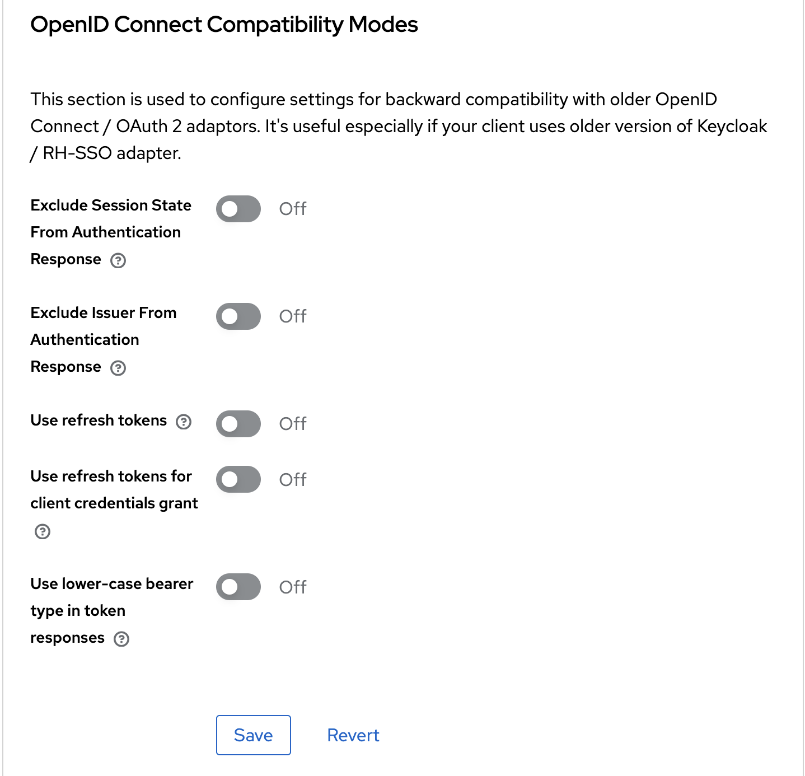

# WoofWoof-backend

## Ajouter le fichier .env

N'oubliez pas d'ajouter le fichier `.env` avec les credentials à la racine du projet.

## Setup avec Docker Compose

Pour pouvoir lancer tous les microservices vous pouvez utiliser nos commandes make ou utiliser docker compose, si vous ne disposez pas de l'outil make

### Commandes disponibles avec make

Pour voir toutes les commandes disponibles, tapez :

```bash
make
```

Cela affichera :

```
WoofWoof Backend - Commandes Docker Compose

  all                  Lance TOUS les services
  clean                Nettoie les images Docker inutilisees
  dev-booking          Dev sur booking-service (lance les autres services dans Docker)
  dev-media            Dev sur media-service (lance les autres services dans Docker)
  dev-stay             Dev sur stay-service (lance les autres services dans Docker)
  dev-woofplanner      Dev sur woofplanner-service (lance les autres services dans Docker)
  down-volumes         Arrete tout et supprime les volumes (perte de donnees)
  down                 Arrete et supprime tous les containers (garde les volumes)
  help                 Affiche cette aide
  infra                Lance l'infrastructure (Eureka, Keycloak, DBs, Gateway)
  logs                 Affiche les logs de tous les services
  logs-infra           Affiche les logs de l'infrastructure uniquement
  ps                   Liste les containers en cours d'execution
  rebuild              Rebuild un service specifique (usage: make rebuild SERVICE=stay-service)
  stop-services        Arrete uniquement les services metier (garde l'infra)
```

### Lancer tous les services

**Demarrage rapide :**

```
# Lancer tous les services
make all
```

## Configuration de Keycloak

Accédez à http://localhost:8000 dans votre navigateur

Puis connectez-vous avec :

- Nom d'utilisateur : admin
- Mot de passe : admin

Le realm WoofWoof est automatiquement créé avec les clients, utilisateurs et rôles de base.

!! Mais vous devez lier les utilisateurs à leurs rôles woofer et backpacker.

!! Et attribuer un mot de passe non temporaire à chaque utilisateur.

!! Désactiver le refresh token dans les paramètres avancés du client expo-client.

